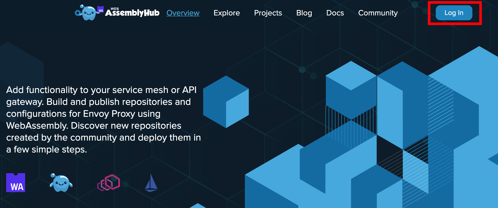
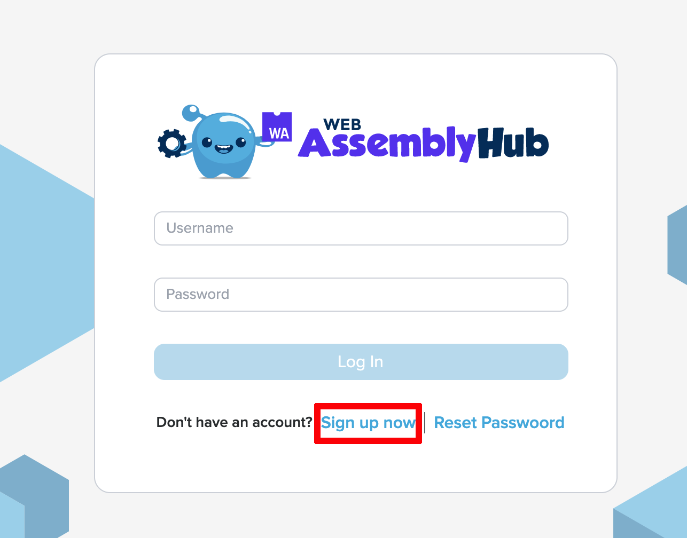
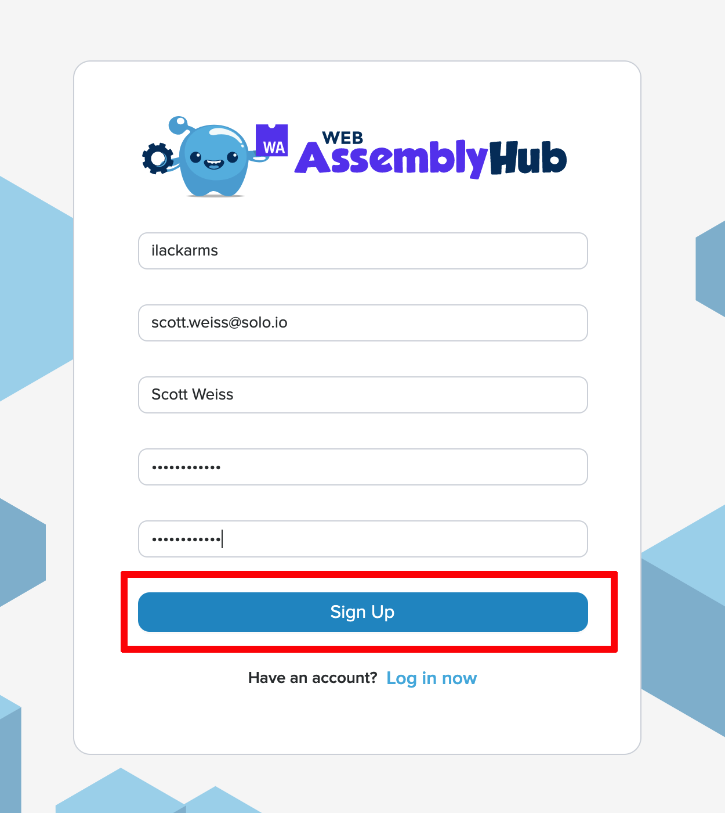
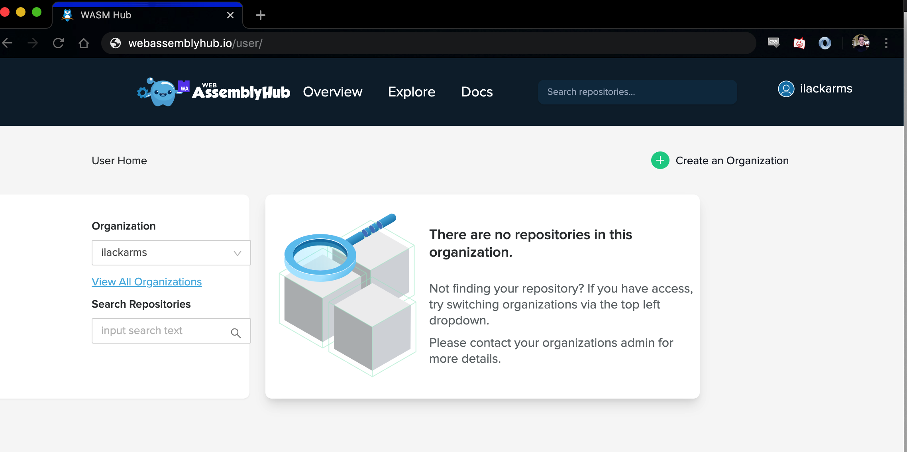

In this tutorial we will:

1. Write our own custom filter for Envoy
2. `build` a WASM module from our filter and store it as an OCI image/
3. `push` the module to the [WebAssembly Hub](https://webassemblyhub.io)
4. `deploy` the image to a running instance of Envoy.
4. `curl` the instance to see our filter act on a request.

For in-depth guides, please refer to:

- [Build tutorials](../build_tutorials) for topics relating to *building* WASM filters 
- [Deployment tutorials](../deploy_tutorials) for topics relating to *deploying* WASM filters 

## Creating a new WASM module

### Install the `wasme` CLI

In order to create and deploy a WASM filter, we'll use the `wasme` command line tool. `wasme` makes 
building and managing Envoy WASM filters similar to how `docker` builds and manages Linux containers.

To install `wasme`:

```bash
curl -sL https://run.solo.io/wasme/install | sh
export PATH=$HOME/.wasme/bin:$PATH
```

Verify that `wasme` installed correctly:
```bash
wasme --version
```

```
wasme version 0.0.25
```

### Initialize a new filter project

Let's create a new project called `new-filter`:

```shell
$  wasme init ./new-filter
```

You'll be asked with an interactive prompt which language platform you are building for. At time of writing, the AssemblyScript Filter base is compatible with Istio 1.5.x, 1.6.x and Gloo 1.3.x:

```shell script
? What language do you wish to use for the filter:
    cpp
  ▸ assemblyscript
? With which platforms do you wish to use the filter?:
  ▸ gloo:1.3.x, istio:1.5.x, istio:1.6.x
```

```
INFO[0014] extracting 1973 bytes to /Users/ilackarms/go/src/github.com/solo-io/wasme/new-filter
```

The `init` command will place our *base* filter into the `new-filter` directory:

```shell
cd new-filter
tree .
```

```
.
├── assembly
│   ├── index.ts
│   └── tsconfig.json
├── package-lock.json
├── package.json
└── runtime-config.json
```

Open this project in your favorite IDE. The source code is [AssemblyScript](https://github.com/AssemblyScript/assemblyscript) (a subset of [Typescript](https://www.typescriptlang.org/)) and we'll make some changes to customize our new filter.

## Making changes to the base filter

The new directory contains all files necessary to build and deploy a WASM filter with `wasme`.

Open `assembly/index.ts` in your favorite text editor. The source code is AssemblyScript and we'll make some changes to customize our new filter.

Navigate to the `onResponseHeaders` method defined near the top of the file. Let's add a new header that we can use to verify our module was executed correctly (later down in the tutorial). Let's add a new response header `hello: world!`:

```typescript
      stream_context.headers.response.add("hello", "world!");
```

Your method should look like this:

```typescript
  onResponseHeaders(a: u32): FilterHeadersStatusValues {
    // add the hello: world! response header
    stream_context.headers.response.add("hello", "world!");
    // continue execution of the filter chain
    return FilterHeadersStatusValues.Continue;
  }
```

Now, let's build a WASM image from our filter with `wasme`. The filter will be tagged and stored in a local registry, similar to how [Docker](https://www.docker.com/) stores images. 

Build and tag our image like so:

```shell
wasme build assemblyscript -t webassemblyhub.io/$YOUR_USERNAME/add-header:v0.1 .
```

```
INFO[0010] adding image to cache...                      filter file=/tmp/wasme653155634/filter.wasm tag="webassemblyhub.io/ilackarms/add-header:v0.1"
INFO[0010] tagged image                                  digest="sha256:8b74e9b0bbc5ff674c49cde904669a775a939b4d8f7f72aba88c184d527dfc30" image="webassemblyhub.io/ilackarms/add-header:v0.1"
```

The module will take less than a minute to build. In the background, `wasme` has launched a Docker container to run the necessary build steps. 

When the build has finished, you'll be able to see the image with `wasme list`:

```bash
wasme list
```

```
NAME                                   TAG  SHA      UPDATED             SIZE   
webassemblyhub.io/ilackarms/add-header v0.1 bbfdf674 26 Jan 20 10:45 EST 1.0 MB 
```

## Pushing your new WASM module 

In order to push the module to a registry, we'll need to log in. If you've already logged in, you can skip this step.

### Create a User on [`webassemblyhub.io`](https://webassemblyhub.io)

Pushing images with `wasme` requires a compatible OCI registry. In this tutorial, we'll use [`webassemblyhub.io`](https://webassemblyhub.io) as our remote registry. 

Let's open [`webassemblyhub.io`](https://webassemblyhub.io) in the browser to create an account. 

1. Click **Log In** in the top right:

    

1. Choose **Sign up now** under the login form:

    
    
1. Fill out the sign-up form and click **Sign Up**:

    
    
1. You should now be logged in as a new user:

    

Now we can log in on the command-line.

## Log In from the `wasme` command line

In order to push images under our new username, we'll need to store our credentials where `wasme` can access them.

Let's do that now with `wasme login`:

```bash
 wasme login -u $YOUR_USERNAME -p $YOUR_PASSWORD
```

```
INFO[0000] Successfully logged in as ilackarms (Scott Weiss)
INFO[0000] stored credentials in /Users/ilackarms/.wasme/credentials.json
```

Great! We're logged in and ready to push our image.

## Push the image

Pushing the image is done with a single command:

```bash
wasme push webassemblyhub.io/$YOUR_USERNAME/add-header:v0.1
```

```
INFO[0000] Pushing image webassemblyhub.io/ilackarms/add-header:v0.1
INFO[0006] Pushed webassemblyhub.io/ilackarms/add-header:v0.1
INFO[0006] Digest: sha256:9d4b4660f71f2714cc71e2b844e9b8460def21f6d76259140e70d447ccc7c702
```
 
Awesome! Our image should be pushed and ready to deploy.
 
## View our published image 

We can verify the image was pushed via the command-line:

```bash
wasme list --search $YOUR_USERNAME
```

```
NAME                                   TAG  SIZE    SHA      UPDATED
webassemblyhub.io/ilackarms/add-header v0.1 13.8 kB 9d4b4660 05 Mar 20 01:12 UTC
```

## Deploy our new module

In this section we'll be deploying our filter to Envoy which is serving as an edge proxy for the Gloo API Gateway.

### Prepare environment

To get started, let's deploy a sample service that we can call through Envoy. We'll deploy the sample petstore API:

```shell
kubectl apply -f https://raw.githubusercontent.com/solo-io/gloo/master/example/petstore/petstore.yaml
```

You should now have the petstore running:

```shell
$  kubectl get po 

NAME                        READY   STATUS    RESTARTS   AGE
petstore-5dcf5d6b66-n8tjt   1/1     Running   0          2m20s
```

### Deploying Gloo/Envoy

In this tutorial, we'll use Gloo, an API Gateway based on Envoy that has built-in wasm support but these steps should also work for base Envoy.

First, install Gloo using one of the following installation options: 



helm repo add gloo https://storage.googleapis.com/solo-public-helm
helm repo update
kubectl create ns gloo-system
helm install --namespace gloo-system --set global.wasm.enabled=true gloo gloo/gloo


glooctl install gateway -n gloo-system --values <(echo '{"namespace":{"create":true},"crds":{"create":true},"global":{"wasm":{"enabled":true}}}')



### Verify set up

Lastly, we'll set up our routing rules to be able to call our `petstore` service. Let's add a route to the routing table:

Create a Gloo VirtualService to route to the `petstore`:

```shell
cat <<EOF | kubectl apply -f-
apiVersion: gateway.solo.io/v1
kind: VirtualService
metadata:
  name: default
  namespace: gloo-system  
spec:
  virtualHost:
    domains:
    - '*'
    routes:
    - matchers:
      - prefix: /
      routeAction:
        single:
          upstream:
            name: default-petstore-8080
            namespace: gloo-system
EOF
```

To get Gloo's external IP, run the following:

```shell
URL=$(kubectl get svc -n gloo-system gateway-proxy -o jsonpath='{.status.loadBalancer.ingress[*].ip}')
```

Now let's curl that URL:

```shell
curl -v $URL/api/pets
```

```
*   Trying 34.74.28.75...
* TCP_NODELAY set
* Connected to 34.74.28.75 (34.74.28.75) port 80 (#0)
> GET /api/pets HTTP/1.1
> Host: 34.74.28.75
> User-Agent: curl/7.54.0
> Accept: */*
>
< HTTP/1.1 200 OK
< content-type: application/xml
< date: Thu, 05 Mar 2020 01:14:01 GMT
< content-length: 86
< x-envoy-upstream-service-time: 3
< server: envoy
<
[{"id":1,"name":"Dog","status":"available"},{"id":2,"name":"Cat","status":"pending"}]
* Connection #0 to host 34.74.28.75 left intact
```

If you're able to get to this point, we have a working Envoy proxy and we're able to call it externally. 


To deploy the module to Envoy via Gloo:

```bash
wasme deploy gloo webassemblyhub.io/$YOUR_USERNAME/add-header:v0.1 --id=add-header
```

It will take a few moments for the image to be pulled by the server-side cache.

## Verify behavior

To verify the behavior, let's use the `curl` command from above:

```shell
curl -v $URL/api/pets
```

We expect to see our new headers in the response:

```
*   Trying 34.74.28.75...
* TCP_NODELAY set
* Connected to 34.74.28.75 (34.74.28.75) port 80 (#0)
> GET /api/pets HTTP/1.1
> Host: 34.74.28.75
> User-Agent: curl/7.54.0
> Accept: */*
>
< HTTP/1.1 200 OK
< content-type: application/xml
< date: Thu, 05 Mar 2020 01:19:07 GMT
< content-length: 86
< x-envoy-upstream-service-time: 0
< hello: world!
< server: envoy
<
[{"id":1,"name":"Dog","status":"available"},{"id":2,"name":"Cat","status":"pending"}]
* Connection #0 to host 34.74.28.75 left intact
```

If we can see the new header `hello: world!` in our response, that means everything worked!

You've now gone through the process step-by-step to build and deploy Envoy filters from scratch. 

For guides on performing specific tasks with `wasme`, please refer to:

- [Build tutorials](../build_tutorials) for topics relating to *building* WASM filters 
- [Deployment tutorials](../deploy_tutorials) for topics relating to *deploying* WASM filters 

For more information and support using `wasme` and the Web Assembly Hub, visit the Solo.io slack channel at
https://slack.solo.io.
